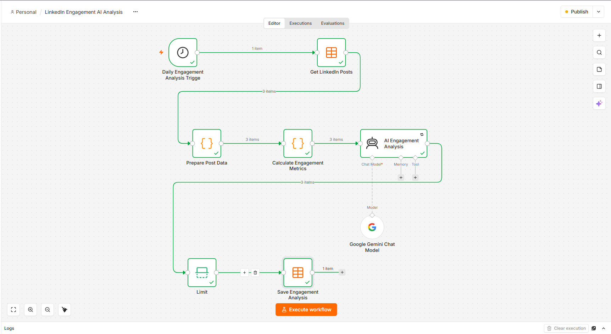
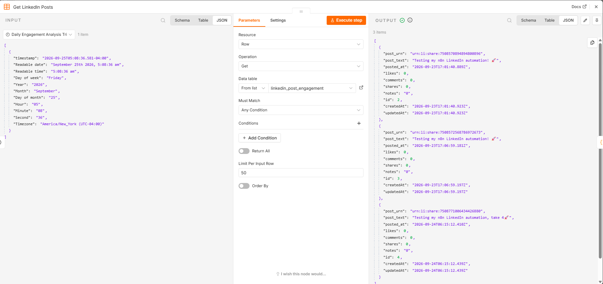
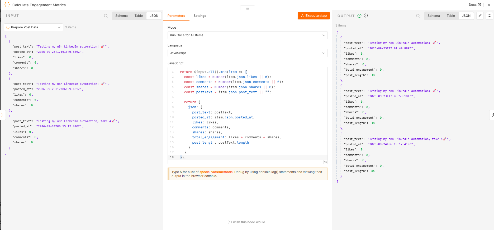
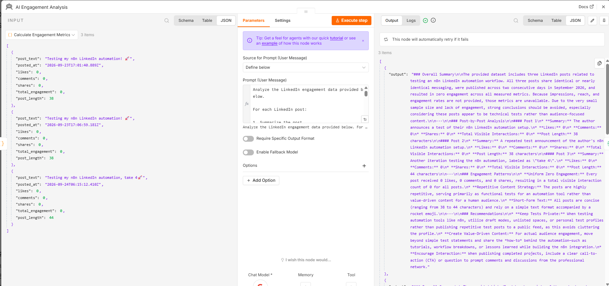
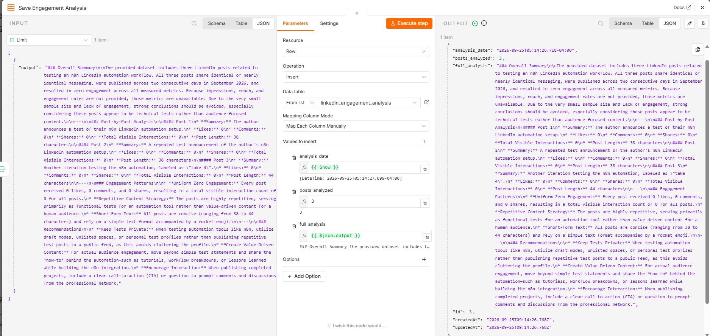

# LinkedIn Engagement Intelligence Agent

An AI-powered LinkedIn engagement analysis workflow built with **n8n** and **Google Gemini**.

The workflow automatically collects LinkedIn post engagement data, calculates visible engagement metrics, analyzes the content using AI, and stores the generated analysis for future review.

---

## 🚀 Project Overview

The **LinkedIn Engagement Intelligence Agent** is an automation workflow designed to help analyze LinkedIn post performance.

Instead of manually reviewing engagement data, the workflow:

* Collects LinkedIn post data from an n8n Data Table
* Prepares and cleans the post data
* Calculates engagement metrics
* Uses Google Gemini to analyze the posts
* Generates content and engagement insights
* Stores the AI-generated analysis in another Data Table
* Runs automatically on a daily schedule

### Workflow

```text
Daily Engagement Analysis Trigger
              ↓
      Get LinkedIn Posts
              ↓
      Prepare Post Data
              ↓
 Calculate Engagement Metrics
              ↓
    AI Engagement Analysis
              ↓
             Limit
              ↓
   Save Engagement Analysis

Google Gemini Chat Model
              ↓
    AI Engagement Analysis
```

---

## ✨ Features

* **Automated daily analysis**
* **LinkedIn post data processing**
* **Engagement metric calculation**
* **AI-powered content analysis**
* **Pattern identification**
* **AI-generated recommendations**
* **Persistent analysis storage**
* **n8n Data Tables**
* **Google Gemini integration**
* **Retry handling for AI requests**

---

## 🧠 AI Analysis

The Google Gemini-powered AI Agent analyzes the available LinkedIn engagement data.

For each post, the AI:

1. Summarizes the post
2. Reports likes, comments, and shares
3. Calculates total visible interactions
4. Compares available engagement data
5. Identifies noticeable content patterns
6. Provides practical recommendations for future posts

The AI prompt is designed to avoid inventing unavailable metrics such as:

* Impressions
* Reach
* Engagement rate

If a metric is not available in the input data, the AI is instructed to state that it is unavailable.

---

## 📊 Engagement Metrics

The workflow calculates:

```text
Total Engagement = Likes + Comments + Shares
```

It also calculates the length of each LinkedIn post.

These metrics provide the input for the AI analysis.

---

## 🔄 Workflow Nodes

| Node                                  | Purpose                                               |
| ------------------------------------- | ----------------------------------------------------- |
| **Daily Engagement Analysis Trigger** | Starts the workflow automatically each day            |
| **Get LinkedIn Posts**                | Retrieves LinkedIn post data from an n8n Data Table   |
| **Prepare Post Data**                 | Selects and normalizes the required post fields       |
| **Calculate Engagement Metrics**      | Calculates total visible interactions and post length |
| **AI Engagement Analysis**            | Uses Google Gemini to analyze the engagement data     |
| **Google Gemini Chat Model**          | Provides the AI language model                        |
| **Limit**                             | Controls the analysis output before saving            |
| **Save Engagement Analysis**          | Stores the generated AI analysis                      |

---

## 🖼️ Workflow Screenshots

### Workflow Overview



### Get LinkedIn Posts



### Engagement Metrics



### AI Engagement Analysis



### Saved Analysis



---

## 🛠️ Technologies Used

* **n8n**
* **Google Gemini**
* **JavaScript**
* **n8n Data Tables**
* **LinkedIn engagement data**
* **Workflow automation**

---

## 📁 Project Structure

```text
n8n-engagement-intelligence-agent/
│
├── screenshots/
│   ├── 01-workflow-overview.png
│   ├── 02-get-linkedin-posts.png
│   ├── 03-engagement-metrics.png
│   ├── 04-ai-engagement-analysis.png
│   └── 05-analysis-data-table.png
│
├── workflow.json
└── README.md
```

---

## ⚙️ Setup

### 1. Clone the repository

```bash
git clone https://github.com/VishwaChandeepa/n8n-engagement-intelligence-agent.git
```

### 2. Import the workflow

Open your n8n instance and import:

```text
workflow.json
```

### 3. Configure the LinkedIn Post Data Table

Create an n8n Data Table named:

```text
linkedin_post_engagement
```

The workflow expects fields such as:

```text
post_text
posted_at
likes
comments
shares
```

### 4. Configure the Analysis Data Table

Create another Data Table named:

```text
linkedin_engagement_analysis
```

with fields:

```text
analysis_date
posts_analyzed
full_analysis
```

### 5. Configure Google Gemini

Create your own Google Gemini credential in n8n and connect it to the:

```text
Google Gemini Chat Model
```

### 6. Configure Data Table IDs

The public workflow contains placeholders:

```text
YOUR_LINKEDIN_POST_DATA_TABLE_ID
```

and:

```text
YOUR_ANALYSIS_DATA_TABLE_ID
```

Replace these with the Data Table IDs from your own n8n instance.

### 7. Activate the workflow

The workflow is configured to run daily at:

```text
09:00
```

Make sure your n8n instance is running when using a self-hosted/local installation.

---

## 🔐 Security

This repository contains a **sanitized workflow configuration**.

No API keys, passwords, or Gemini credentials are included.

Before using the workflow, configure your own:

* Google Gemini credentials
* n8n Data Tables
* Data Table IDs

Never commit API keys, passwords, access tokens, or private credentials to GitHub.

---

## 🎯 Project Goals

This project was created to explore how **workflow automation and generative AI** can be combined to transform raw engagement data into useful content insights.

The project demonstrates practical experience with:

* Workflow automation
* Data processing
* JavaScript in n8n
* AI agents
* LLM integration
* Data persistence
* Scheduled automation
* AI-assisted decision support

---

## 🔮 Future Improvements

Potential future improvements include:

* Automatic LinkedIn API data collection
* Historical engagement tracking
* Engagement trend visualization
* More detailed content classification
* Sentiment analysis
* Post-type comparison
* Automated weekly reports
* Email or Discord notifications
* Dashboard integration
* More advanced AI recommendations

---

## 👨‍💻 Author

**Vishwa Chandeepa Senarathna**

Software Engineering Undergraduate
NSBM Green University

GitHub: [VishwaChandeepa](https://github.com/VishwaChandeepa)

LinkedIn: [Vishwa Chandeepa](https://linkedin.com/in/vishwachandeepa)

---

## ⭐ Project Status

**Completed — Portfolio Project**

The core workflow has been implemented and tested successfully using n8n, Google Gemini, and n8n Data Tables.
